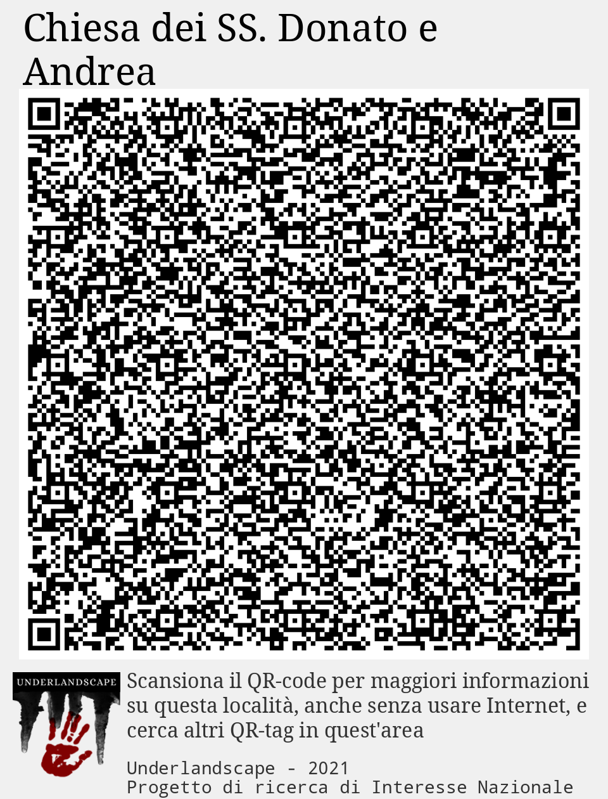

# ITN000a (mappa non collegata)
Test con POI con tutti i tag, un sito, un percorso ed un QRtag
## Percorso: Escursione verso Cocciglia
****
## POI: Buca delle Streghe
****
## POI: Monte Forato
****
## POI: Palina dei sentieri CAI
****
## POI: Stazione ferroviaria
****
## POI: Azienda del Turismo
****
## POI: Pronto Soccorso
****
## POI: Ristorante del buongustaio
****
## POI: Luna Park
****
## POI: Hotel del Sole
**Complesso della rocca sommitale con edifici di servizio, cinta muraria sul lato N e W, cisterna e possibile torre; sporadici frammenti ceramici bassomedievali**
## POI: Museo delle trottole
****
## POI: Monumento ai Caduti
****
## QRtag: Chiesa dei SS. Donato e Andrea
 ****
## Sito: Metato
**Complesso architettonico a pianta rettangolare in muratura alla moderna, a due piani, con accesso in quota per carico delle castagne e tettoia laterale**
